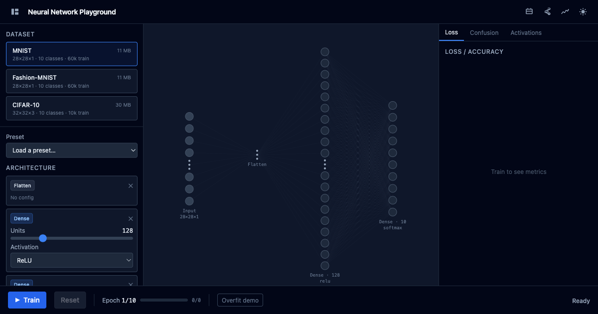

# Neural Network Playground

**Train real neural networks in your browser. Watch them learn in real time.**

Neural Network Playground is a fully client-side, zero-backend environment for building, training, and inspecting deep learning models — no Python, no cloud credits, no setup beyond a browser tab. It's the hands-on companion for anyone who wants to *see* how neural networks actually work, not just read about them.



[](LICENSE)
[](https://nextjs.org)
[](https://www.tensorflow.org/js)

---

## Why this exists

Most neural network visualizations show you cartoon diagrams of circles and arrows. They explain *concepts* but never let you touch a real model.

Meanwhile, the tools that do let you train real models — PyTorch, Keras, Colab notebooks — require you to write code before you can see anything happen.

Neural Network Playground sits in the middle: **real training on real datasets, with zero friction.** You open it, pick a dataset, stack some layers, hit Train, and immediately watch:

- Connection weights change color as gradients flow backward
- Loss drop (or not) with each epoch
- Confusion between classes emerge on a live matrix
- Individual neurons activate in response to specific input patterns

It's the difference between reading about swimming and getting in the water.

---

## What you can do

### Build any architecture
Stack **Dense**, **Flatten**, **Conv2D**, **MaxPooling**, and **Dropout** layers in any order using a drag-and-drop-style panel. The playground validates your architecture in real time — spatial dimensions are tracked automatically so you always know if a Conv layer's output will fit the next layer's input.

Six presets are built in to get you started: Simple Dense, Deep Dense, Wide Dense, Simple CNN, LeNet-5, and Deep CNN.

### Train on real datasets
Three datasets are available, cached in your browser's IndexedDB after the first download so they load instantly on every subsequent visit:

| Dataset | Size | Resolution | Classes |
|---------|------|------------|---------|
| **MNIST** | 11 MB | 28×28 grayscale | 10 handwritten digits |
| **Fashion-MNIST** | 11 MB | 28×28 grayscale | 10 clothing categories |
| **CIFAR-10** | 30 MB | 32×32 RGB | 10 object categories |

### Watch it learn in real time
Training runs entirely in a **Web Worker**, keeping the UI at full frame rate while the model trains. Every few batches, the playground pushes weight snapshots to the main thread and renders them on a Canvas 2D graph — connections glow blue for negative weights, red for positive, with intensity proportional to magnitude.

No waiting for an epoch to finish. No polling a remote server. Just live feedback.

### Inspect what's happening inside
Switch between three analysis panels while training or after:

- **Loss & Accuracy** — smoothed training and validation curves rendered with D3.js. The gap between train and val loss tells you immediately if you're overfitting.
- **Confusion Matrix** — a canvas-rendered heatmap showing exactly which classes your model is confusing. Hover any cell for true label / predicted label / count.
- **Activation Viewer** — after training, pick any test image and see every layer's response to it. Dense layers show activation bar charts; convolutional layers show feature maps rendered with the Viridis colormap.

### Share any setup with a link
Click the share button and the entire network configuration — layer types, units, activations, hyperparameters, dataset — is compressed with LZ-string and encoded into a URL hash. Paste the link and anyone lands on exactly your setup, ready to train.

---

## Guided tutorials

Not sure where to start? Three built-in tutorials walk you through the core concepts, automatically loading the right preset and switching panels as you progress:

**What is a Neuron?**
Starts with a minimal 2-layer network and walks through what a weight is, why it changes, and what loss actually measures. Good for absolute beginners.

**Why Overfitting Happens**
Deliberately trains a network on a tiny sample for too many epochs. You watch train loss plunge toward zero while val loss climbs — the textbook definition of memorization vs. generalization, visible in under two minutes.

**How CNNs See Images**
Loads a LeNet-style CNN, trains it on MNIST, then takes you to the Activation Viewer to see what each convolutional layer responds to. The first layer finds edges; deeper layers find shapes. Seeing it is worth a thousand diagrams.

---

## Overfitting demo mode

One button limits training to 500 samples for 50 epochs — a recipe guaranteed to produce overfitting on any dataset. Watch the train/val loss curves diverge in real time. Use it to build intuition for when to stop training, add dropout, or collect more data.

---

## Technical highlights

Everything runs in your browser. There is no server, no API, no account.

| Concern | Approach |
|---------|----------|
| **ML runtime** | TensorFlow.js 4.x with WebGPU → WebGL → WASM fallback |
| **Training thread** | Dedicated Web Worker via Comlink — main thread never blocks |
| **Network graph** | Canvas 2D at interactive frame rates — SVG would choke on large networks |
| **Dataset caching** | IndexedDB via idb-keyval — downloads once, loads instantly forever |
| **URL sharing** | LZ-string compression into `#config=` hash — server never sees it |
| **Charts** | D3.js, lazy-loaded — excluded from initial bundle |
| **Architecture** | Next.js 14 static export — deploys to any CDN with zero config |

---

## Running locally

```bash
# Install dependencies
pnpm install

# Start dev server
pnpm dev
```

Open http://localhost:3000. MNIST and Fashion-MNIST work immediately. For CIFAR-10:

```bash
node scripts/prepare-cifar10.js
```

This downloads the CIFAR-10 binary format from the University of Toronto (~162 MB), merges the five training batches into a single file, and writes both `cifar10_train.bin` and `cifar10_test.bin` to `public/datasets/cifar10/`.

### Building for production

```bash
pnpm build
```

Outputs a fully static site to `out/`. Deploy to Vercel, Netlify, GitHub Pages, or any static host.

---

## Project structure

```
src/
├── app/                  Next.js app router (layout, page, globals)
├── components/
│   ├── playground/       All playground panels and the shell
│   │   ├── PlaygroundShell.tsx     Layout + header + URL hydration
│   │   ├── NetworkCanvas.tsx       Canvas 2D graph + weight heatmaps
│   │   ├── NetworkArchitect.tsx    Layer builder panel
│   │   ├── DatasetSelector.tsx     Dataset picker
│   │   ├── HyperparamPanel.tsx     Optimizer, LR, batch size, epochs
│   │   ├── TrainingControls.tsx    Train/pause/reset + progress bar
│   │   ├── LossCurveChart.tsx      D3 loss + accuracy chart
│   │   ├── ConfusionMatrix.tsx     Canvas confusion matrix
│   │   ├── ActivationViewer.tsx    Per-layer activation inspector
│   │   └── TutorialOverlay.tsx     Guided tutorial overlay card
│   └── ui/               Primitive components (Button, Slider, Select)
├── constants/            Presets, tutorials, dataset metadata, defaults
├── lib/                  Backend selector, model compiler, dataset loader,
│                         architecture validator, network layout, URL state
├── stores/               Zustand stores (architecture, training, UI)
├── types/                Shared TypeScript types
└── workers/              Training Web Worker + Comlink typed API
```

---

## Tech stack

| Layer | Technology |
|-------|-----------|
| Framework | Next.js 14 (App Router, static export) |
| Language | TypeScript 5.x (strict mode) |
| ML runtime | TensorFlow.js 4.x |
| ML acceleration | WebGPU (fallback: WebGL → WASM) |
| Training isolation | Web Worker + Comlink 4.x |
| Visualization | Canvas 2D (network) + D3.js 7.x (charts) |
| State management | Zustand 4.x |
| Dataset caching | IndexedDB via idb-keyval |
| URL compression | LZ-string |
| Styling | Tailwind CSS 3.x |

---

## License

MIT — see [LICENSE](LICENSE). Use it, fork it, embed it in your course, deploy it for your students.
